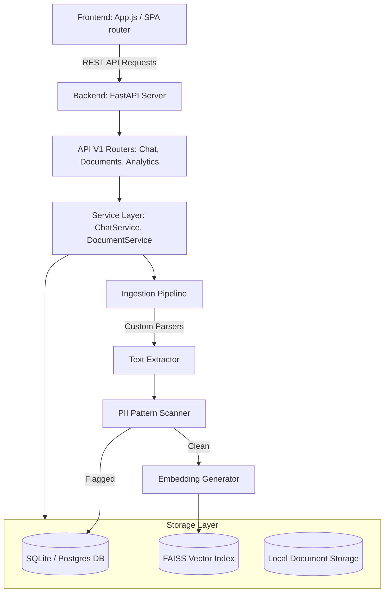

# Product Requirement Document (PRD)

## Project Name: Maruti Suzuki Knowledge Assistant (MSKA)
**Document Version**: 1.0.0  
**Target Audience**: Product Managers, Engineering Teams, Corporate Quality Control Leads, and Plant Administrators.  

---

## 1. Executive Summary & Goals

### 1.1 Document Overview
The **Maruti Suzuki Knowledge Assistant (MSKA)** is a secure, AI-powered Retrieval-Augmented Generation (RAG) platform designed to centralize and safely search vehicle assembly guidelines, Standard Operating Procedures (SOPs), quality standards, and corporate directives.

### 1.2 Core Problem Statement
* **Jargon Overload**: Assembly line technicians face challenges interpreting complex corporate engineering specifications.
* **Security & Clearance Leaks**: Critical intellectual property (e.g., proprietary manufacturing processes or secret coatings) must not leak to unauthorized personnel.
* **PII Compliance**: Accidental ingestion of documents containing PII (Aadhaar cards, PAN card numbers, salaries) can violate Indian data residency laws.
* **RAG Cost & Hallucinations**: Standard LLM integrations are prone to hallucinations, especially when retrieving technical parameters or codes.

### 1.3 Key Product Objectives
1. **Verified Answers (Zero-Hallucination Guard)**: Refuse to answer queries if the similarity search confidence is below a configurable threshold.
2. **Aesthetics & Premium UI**: Wow corporate stakeholders with a high-fidelity dashboard incorporating Maruti Suzuki branding, vehicle visualizations, and modern CSS glassmorphism.
3. **PII Safety Net**: Screen all files at ingestion for Indian PII patterns (Aadhaar, PAN, emails, phones) and quarantine them automatically.
4. **Simplification Engine ("Explain Simply")**: Translate dense specifications into plain-English/Hindi plant-floor bullet points.
5. **Robust Mocking**: Run entirely locally with a simulated AI provider and FAISS vector index, allowing offline demos without recurring LLM costs.

---

## 2. User Personas & Role-Based Access Control

The platform enforces a role-based access classification system. Each document is labeled with a clearance level, and users are mapped to specific roles:

### 2.1 User Personas

| Role | Target User | Data Clearance Levels | Allowed Operations |
| :--- | :--- | :--- | :--- |
| **Platform Admin** | System / IT Managers | Public, Internal, Confidential, Restricted | Complete system configuration, user provisioning, document override. |
| **Auditor** | EHS & Compliance inspectors | Public, Internal, Confidential, Restricted | View audit logs, verify quarantined files, inspect user actions. |
| **Department Lead** | Body Shop / Paint Shop / Quality Leads | Public, Internal, Confidential | Add projects, upload files within department, start chat queries. |
| **Project Admin** | Team managers / Project coordinators | Public, Internal, Confidential | Manage project memberships, upload and delete project documents. |
| **Employee** | Assembly technicians, line operators | Public, Internal | Query chat assistant, view approved files, simplify instructions. |

### 2.2 Classification Clearance Matrix

* **Restricted**: Suzuki global trade secrets (e.g. engine coating tolerances). Visible ONLY to Platform Admins and Auditors.
* **Confidential**: Supplier cost details, quality reviews. Visible to Project Admins, Department Leads, and above.
* **Internal**: General shop floor manuals. Visible to standard employees.
* **Public**: Plant safety posters, basic HR forms. Visible to all.

---

## 3. Core Architecture & Component Workflow

### 3.1 Ingestion Flow
1. **Upload**: User submits a document via the Document Manager panel.
2. **Parsing**: The pipeline maps the file suffix to its corresponding parser:
   - `.pdf` (ReportLab / PyPDF extractor)
   - `.docx` (python-docx parser)
   - `.xlsx` / `.xls` (openpyxl parser)
   - `.pptx` (python-pptx parser)
   - `.csv` (standard text grid processing)
   - `.txt` (UTF-8 binary translation)
3. **PII Filtering**: A regex scanner matches:
   - Aadhaar numbers (`^\d{4}\s\d{4}\s\d{4}$`)
   - PAN Card numbers (`^[A-Z]{5}\d{4}[A-Z]$`)
   - Standard email format and phone numbers.
   *Action*: If any match is found, the file status is flagged as `quarantined` and text indexing is aborted.
4. **Chunking & Vectorizing**: Approved files are chunked (default: 512 chars, 64-char overlap) and embedded (using `SentenceTransformer` or character-hashed fallback).
5. **FAISS Index Write**: Chunks are added to the corresponding project namespace in the vector database.

### 3.2 Chat & Retrieval Flow
1. **Query**: The technician types a query (e.g., *"How to calibrate the welding robot?"*).
2. **Dense Similarity Search**: The vector store returns top matches from the project's namespace.
3. **Lexical Boosting (Rerank)**: A composite scorer (70% dense cosine score + 30% word match count ratio) boosts chunks containing exact serial numbers, codes, or instructions.
4. **Confidence Verification**:
   - Compares the top matched score against `RAG_CONFIDENCE_THRESHOLD`.
   - If the score falls short, it activates **Abstention Mode** and returns: *"I do not have enough verified information to answer your request."*
5. **LLM Generation**: The AI Provider (Azure OpenAI, Copilot Studio, or Mock adapter) compiles the answers with bracketed context citation references.

---

## 4. Functional Specifications

### 4.1 UI & UX (Visual System)
* **Theme**: Glassmorphism aesthetic. Transparent, blurred white backing elements with rich contrast.
* **Colors**: Curated Maruti Suzuki brand blue (`var(--ms-color-primary-500)`), crimson accents, and bright emerald success highlights.
* **Visual Asset**: Centerpiece concept electric vehicle (EV) graphic located in the dashboard hero card.
* **SPA Routing**: Client-side hash routing (`#/dashboard`, `#/chat`, `#/documents`, `#/search`, `#/projects`, `#/departments`, `#/admin`).

### 4.2 Dashboard & Analytics
* **Approved SOPs Indicator**: Displays total count of healthy files in the database.
* **Quarantined Files Indicator**: Highlights total blocked documents (gives visible proof of PII system working).
* **Recent Activity Feed**: Real-time log of background tasks (e.g. document ingests, chat queries, and project allocations).

### 4.3 Chat Assistant Features
* **Explain Simply**: Applies a plant-floor simplification prompt instruction template to the matched response. Output formats in clean, bulleted steps.
* **Bookmarks**: Pins selected chat questions and citations directly to the dashboard quick links index.
* **Source Citations**: Renders clickable file references below each response block so users can verify the source manual.

---

## 5. Technical Stack & Deployment Constraints

* **Backend Framework**: Python 3.10+ FastAPI (Asynchronous database access with `SQLAlchemy` + `aiosqlite`).
* **Frontend**: Vanilla Javascript Single Page Application (Web Components, custom tags, CustomEvent store subscriptions).
* **Database**:
  - Development: Local SQLite file (`mskai.db`).
  - Production: PostgreSQL.
* **NLP & Vector Store**:
  - Development Fallback: In-memory Numpy cosine search index (avoids C++ compile issues).
  - Production: FAISS index binary files (`storage/vectors/*.index`).
* **Environment variables**: Loaded from `.env` dynamically via Pydantic settings schema.

---

## 6. Future Roadmap

1. **Voice Integration**: Convert Hindi speech transcripts into search vectors for on-the-floor voice queries.
2. **Multilingual translation**: Support instant switching of answers between English, Hindi, and regional dialects.
3. **Alembic Database Migration**: Manage production schema upgrades.
